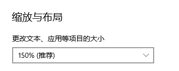

# UMS
## Easy Start
1. You should prepare 2 computers running on the same LAN, one of which is Server and the other is Client;.
2. Fill in the ``Target IP`` blank and click on ``connect`` button to connect with other devices. This operation is required both on the Server and the Client computer.
3. Check the screen scale of your device. For Windows users, click on the mouse right and open Display Settings. Find the scale and fill in the blank. Click ``set`` button to confirm.
    
4. Tick the check box ``Main Device`` for one of your device, which defines it as Server and leaves the other computer Client. Then you press the `Start Unbounded Mouse` button on both computers to establish mouse connection between them. After that, you click the `Start Unbounded Mouse` button on the Server again, which enables the unbounded mouse. 
5. Click on ``Open File`` and choose the file you want UMS to manage. Now you can easily transmit the file to your other device just by dragging it to the left screen bound.
